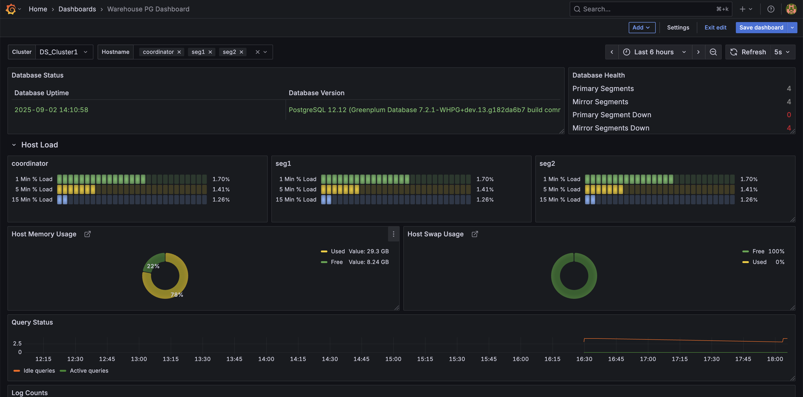

# WarehousePG Observability docker setup

This repository provides way to create Docker configurations for setting up WarehousePG cluster observability 
for multiple cluster using WHPG Exporter, Prometheus, Grafana.

## Prerequisites
1. Install docker and docker compose plugin.(https://docs.docker.com/compose/install/)
2. Install git.
3. Make sure you have extension installed on all the WarehousePG clusters.(https://github.com/warehouse-pg/warehouse-pg-observability-extension)

## Usage
In the main directory, type make to see a list of available options.

1. Create a _config_local.py_ file in the home directory by copying _config.py_ and change the values for 
_NUMBER_OF_WHPG_CLUSTER_ which equates to number of WarehousePG cluster want to monitor. 
Create a dictionary which contains key pair with _cluster_name:cluster_connection_url_

2. Run below command to pull the latest exporter code, build docker image, pull docker images for prometheus and grafana
and launch respective containers.
`make build`

3. Verify the containers
`make status`

4. Stop the containers.
`make stop`

5. Clean everything
`make clean`

## Start viewing dashboard in grafana
Log in Grafana (localhost:3000) with default username admin and password secret.(if not overrided in .env file) 

## FAQ