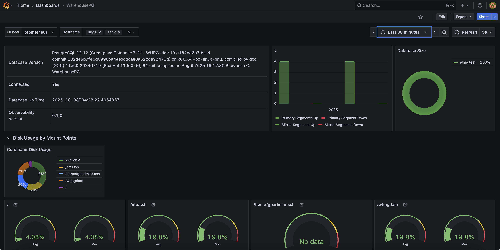
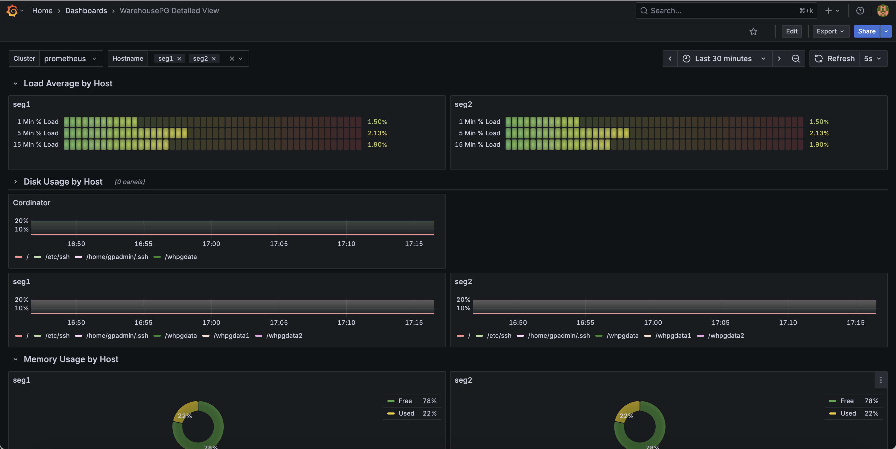

# Monitoring setup for WarehousePG
This guide explains how to configure monitoring for a WarehousePG cluster using **Prometheus** and **Grafana**.
<br>The WarehousePG monitoring stack includes the following components:
1. **Extension** - Creates views that exposes monitoring data for the WarehousePG cluster.
2. **Exporter** - Collects metrics from the WarehousePG cluster using the monitoring extension and exposes them in a format compatible with Prometheus for real-time monitoring.
3. **Prometheus** - Stores historical data.
4. **Grafana** - Creates dashboards and visual graphs

## Setup
1. **Setting up the Extension**
<br>An extension installed on the WarehousePG cluster that provides an observability schema with views exposing monitoring data.
Follow instructions [here](install_extension.md) to install and run the extension.


2. **Setting up the Exporter**
<br>The exporter collects data from the WarehousePG cluster and exposes it for Prometheus. 
It internally calls the observability package functions to gather data and converts it into Prometheus metrics.
Check [this](install_exporter.md) link for the setup

3. **Configuring Prometheus**
<br>Add the exporter to the scrape_configs section of your prometheus.yml configuration file:
    ```
   - job_name: whpg_cluster_monitoring
      scrape_interval: 30s
      scrape_timeout: 28s
      static_configs:
        - targets:
          - "<exporter_url>:<exporter_port>"
   ```
    **scrape_interval** and **scrape_timeout** should be configured based on the WarehousePG cluster's response time.
    Generally, scrape_timeout should be slightly less than scrape_interval.

    To determine an appropriate scrape_interval, use the following command to measure the response time:
    ```
   curl -w "Total time: %{time_total} seconds\n" -o /dev/null -s <exporter_url>:<exporter_port>/metrics
   ```

4. **Configuring Data Source and Importing Dashboards into Grafana**

   a. **Add Prometheus as a data source:**<br>
   1. Log in to Grafana with Admin privileges.
   2. Go to Connections > Data Sources.
   3. Click _Add new data source_.
   4. Select Prometheus.
   5. Enter the Prometheus server URL (e.g., http://<prometheus_host>:9090).
   6. Click Save & Test.

    b. **Import WarehousePG Dashboard:**

   1. Download WarehousePG dashboard JSON file here.
   2. In Grafana, go to Dashboards.
   3. Click on the New dropdown and select Import.
   4. Upload the JSON file or paste its content.
   5. Click Import.
   6. Repeat the same step for importing the WarehousePG Detailed View dashboard.
   
   c. **Access Dashboard**
   <br>Navigate to Dashboards in Grafana and select the WarehousePG dashboard to view the monitoring graphs.
   WarehousePG dashboard
   

   WarehousePG Detailed View dashboard
   


